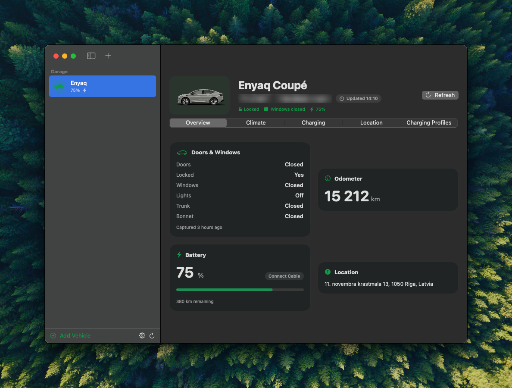
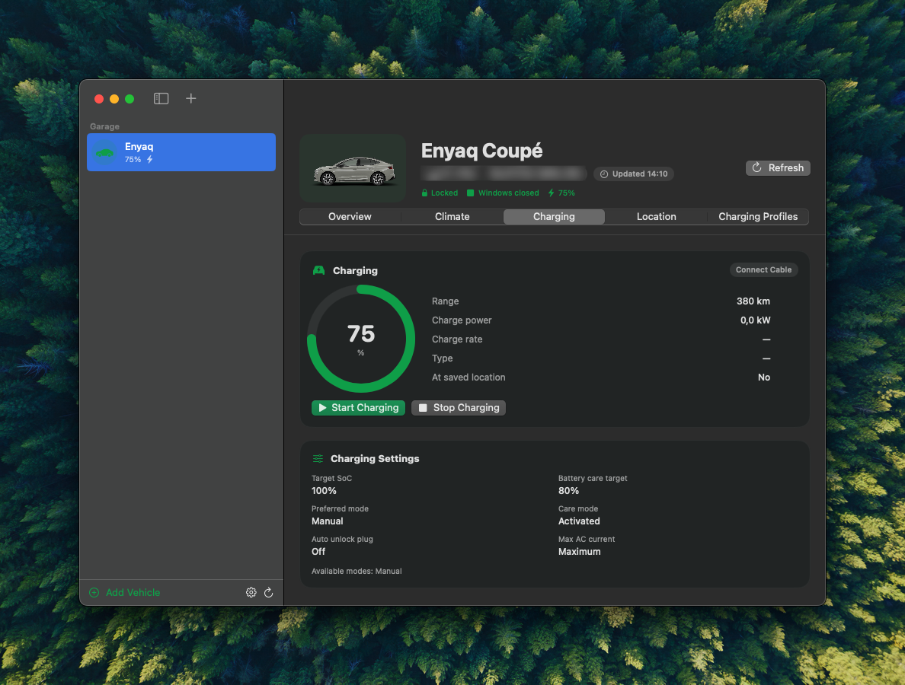
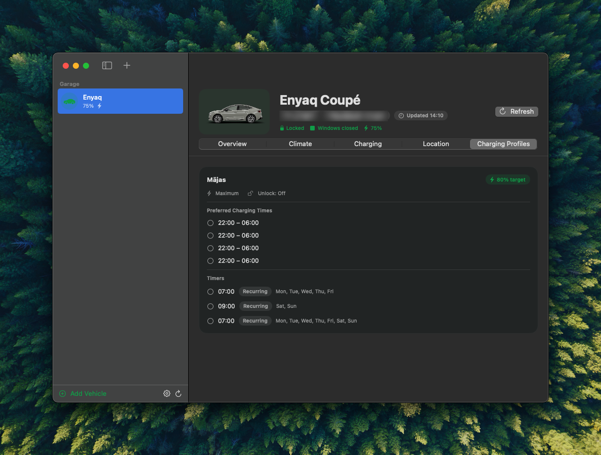
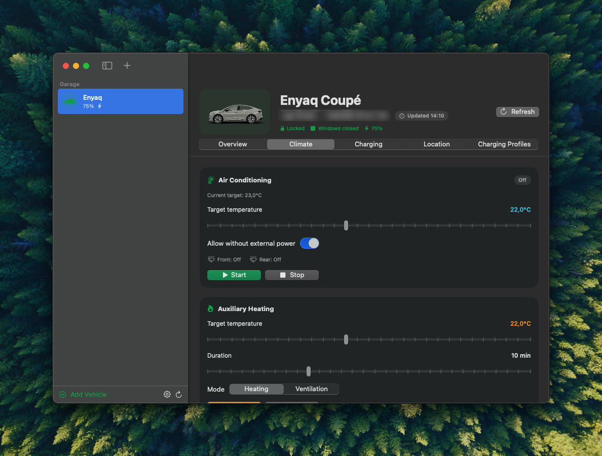
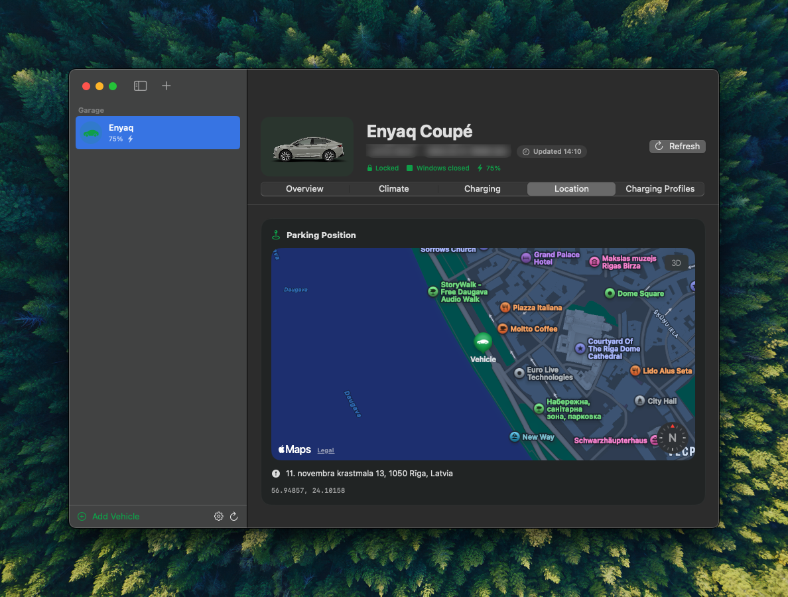

# yourSkoda

A native macOS desktop app for the **Škoda Connect Public API (B2C, Beta)** —
monitor and control your Škoda (e.g. Enyaq Coupe) from your Mac: battery &
charging, climate (A/C, auxiliary heating, active ventilation), doors/windows/
lights status, odometer, and last known parking position.

Built with SwiftUI + Swift Package Manager, no Xcode project required. Not
affiliated with Škoda Auto; this is an unofficial client for the public API
documented at https://public.api.connect.skoda-auto.cz/docs/swagger-ui/index.html.

## Screenshots

|  |  |
| :--: | :--: |
|  |  |
| **Overview** | **Charging** |
|  |  |
| **Charging profiles** | **Climate** |
|  |  |
| **Location** |  |

## Features

Implements every operation exposed by the Public API (v1.0.0-beta.6):

- **Vehicle overview** — name, license plate, render image, doors/windows/
  lights status, odometer, fuel status (combustion/hybrid).
- **Charging** — live battery %, range, charge power/rate, state, start/stop
  charging, charging settings (target SoC, care mode, max AC current, ...),
  and saved charging profiles with preferred times and timers.
- **Climate** — start/stop air conditioning with target temperature, start/
  stop auxiliary heating (requires your vehicle's S-PIN), start/stop active
  ventilation, window heating state.
- **Location** — last known parking position on an interactive map, or "in
  motion" state.
- **Multi-vehicle garage** — add any number of VINs your API key covers.
- **Auto-refresh** with a configurable interval, rate-limit visibility, and
  API key expiry tracking (the API exposes both via response headers).

## Download

Prebuilt Apple Silicon (arm64) builds are attached to each
[GitHub Release](../../releases) as `yourSkoda-<version>-macos-arm64.dmg`.

1. Download the `.dmg`, open it, and drag `yourSkoda.app` into the
   `Applications` shortcut inside.
2. Releases are code-signed with a real Developer ID Application certificate
   and notarized by Apple (see [Cutting a release](#cutting-a-release)), so it
   should open normally with no Gatekeeper warning. If a given release was
   published before notarization was set up, or notarization failed for that
   build, you may briefly see **"yourSkoda" Not Opened** with no bypass option
   — in that case, run this once in Terminal, then open it normally:
   ```sh
   xattr -cr /Applications/yourSkoda.app
   ```
3. Requires macOS 14 (Sonoma) or later, Apple Silicon.

## Getting your API key

The Public API authenticates with a simple API key header (`X-API-Key`), not
OAuth. Create one from the MyŠkoda app or https://go.skoda.eu/api-keys — keys
are scoped to the vehicles you select and they expire, so you'll need to
rotate them periodically. Paste the key into the app's Settings window
(`⌘,`); it's stored in the macOS Keychain, never in plain text on disk.

If you plan to use auxiliary heating, also set your vehicle's **S-PIN** in
Settings — the API requires it for that specific operation.

## Building & running

Requires Xcode 15+ / Swift 5.10+ command line tools on macOS 14 or later.

```sh
# Run directly (debug, launches in Terminal's window session)
swift run

# Or build a proper double-clickable .app bundle into ./build
./scripts/build_app.sh

# ...and install it to /Applications
./scripts/build_app.sh --install
```

`scripts/build_app.sh` builds a release binary, packages it with the
generated icon (`Resources/AppIcon.icns`) and `Info.plist` into
`build/yourSkoda.app`, and code-signs it — ad-hoc by default (so Keychain
access works consistently between launches), or with a real identity if
`CODESIGN_IDENTITY` is set in the environment (see
[Cutting a release](#cutting-a-release)).

To regenerate the app icon (`scripts/generate_icon.swift`, pure AppKit/Core
Graphics, no external assets):

```sh
swift scripts/generate_icon.swift
iconutil -c icns Resources/AppIcon.iconset -o Resources/AppIcon.icns
```

## Cutting a release

Releases are built by
[`.github/workflows/release.yml`](.github/workflows/release.yml) on a
**self-hosted runner** (registered on a Mac that holds the signing
certificate) whenever a tag matching `v*.*.*` is pushed:

```sh
git tag v1.0.0
git push origin v1.0.0
```

The workflow builds the arm64 `.app`, code-signs it with a real
**Developer ID Application** certificate from the runner's Keychain,
packages it as a `.dmg` (via `scripts/make_dmg.sh`), submits it to Apple's
notary service, staples the notarization ticket, and publishes it as a
Release asset with auto-generated notes.

One-time setup on the runner:

1. Import your Developer ID Application certificate + private key into the
   Keychain the runner process uses (typically the login keychain of the
   logged-in session that started the runner), and make sure it's unlocked.
2. Find the exact identity string:
   ```sh
   security find-identity -v -p codesigning
   ```
3. In the GitHub repo, add a repository **variable** (Settings → Secrets and
   variables → Actions → Variables) named `CODESIGN_IDENTITY` with that exact
   string, e.g. `Developer ID Application: Your Name (TEAMID)`.
4. Generate an app-specific password at
   [appleid.apple.com](https://appleid.apple.com) → Sign-In and Security →
   App-Specific Passwords, then store a `notarytool` credential profile in
   the runner's Keychain (this is a one-time, local-only step — nothing is
   sent to GitHub):
   ```sh
   xcrun notarytool store-credentials "yourskoda-notary" \
     --apple-id "you@example.com" \
     --team-id "TEAMID" \
     --password "the-app-specific-password"
   ```
   (An App Store Connect API key works too — see `scripts/make_dmg.sh` for
   the `--key`/`--key-id`/`--issuer` form.) If you use a profile name other
   than `yourskoda-notary`, also add a repository variable `NOTARY_PROFILE`
   with that name.

The workflow fails fast if `CODESIGN_IDENTITY` is unset or not found in the
runner's Keychain. Notarization is best-effort: if the credential profile is
missing or Apple's notary service rejects the submission, the build still
publishes a signed-but-not-notarized `.dmg` rather than failing the release
(see [Download](#download) for what that means for end users).

To build the same artifact locally instead (e.g. to test before tagging):

```sh
# Ad-hoc signed (default, matches local dev builds, no notarization)
./scripts/make_dmg.sh 1.0.0

# Or signed + notarized, same as CI:
CODESIGN_IDENTITY="Developer ID Application: Your Name (TEAMID)" \
  ./scripts/make_dmg.sh 1.0.0
# -> build/dist/yourSkoda-1.0.0-macos-arm64.dmg (+ .sha256)
```

## Project layout

```
Sources/YourSkoda/
  Models/        Codable types mirroring the OpenAPI schema (Vehicle, Charging, ...)
  Networking/     SkodaAPIClient — async/await URLSession client, error mapping
  Persistence/    Keychain wrapper + UserDefaults-backed garage/settings store
  Store/          AppStore — the app's observable state, polling, actions
  Views/          SwiftUI screens (sidebar, overview, climate, charging, map, profiles, settings)
scripts/          Icon generator + .app bundler
screenshots/      PNGs used in this README
```

## Notes on the API

- There is no "list my vehicles" endpoint in the Public API, so vehicles are
  added by VIN manually (the app remembers them).
- Control actions (`/charging/start`, `/air-conditioning/start`, etc.) return
  `202 Accepted` immediately — the app polls the vehicle a couple of seconds
  later to reflect the new state.
- The API is in beta; some fields/operations may be absent for a given
  vehicle, which the app surfaces as a dismissible "data unavailable" banner
  rather than an error.
